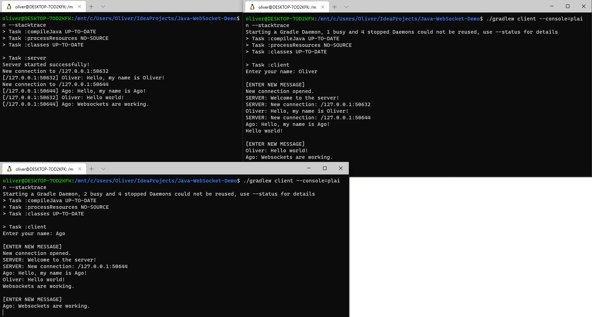

# Java-WebSocket-Demo

Simple example client-server real-time chat application using Java WebSockets for networking and Gson for data serialization.

WebSockets allow you to open a connection and keep it open. Traditionally HTTP is a request, response model, 
and it closes the connection after each data packet it sent.

WebSockets allow an open and persistent connection so you don't have to close it after each data packet is sent. 
This allows for real-time functionality in apps (like Google Docs), games etc. 
[[1]](https://www.reddit.com/r/explainlikeimfive/comments/1fpwqx/eli5_what_are_websockets/cc307f6)

## Running the application

The project uses Gradle, so you shouldn't need to install/configure anything manually, it should just work.
First start Server.java then Client.java files.

One way is to run them using IntelliJ, 
the other way is to run them directly in terminal (e.g. when running it on a Linux server).

For Windows replace `./gradlew` with `gradlew.bat`.

### Server

`./gradlew server --console=plain --stacktrace`

### Client

`./gradlew client --console=plain --stacktrace`

Serializer.java class converts your data objects to JSON strings and vice versa.

You can read more about Java WebSockets and find more examples from [here](https://github.com/TooTallNate/Java-WebSocket).
